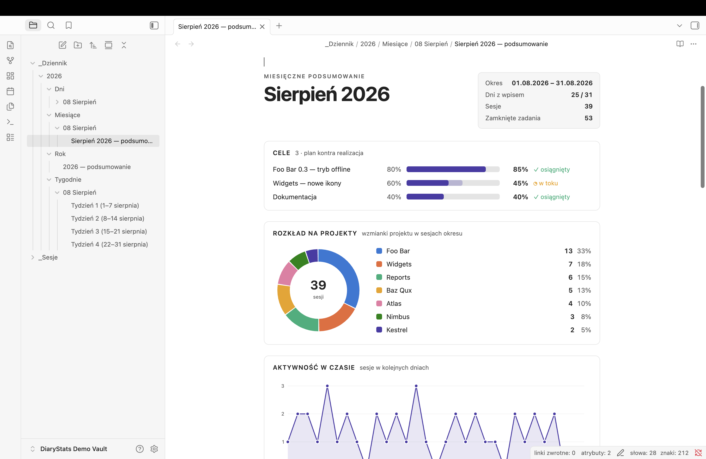
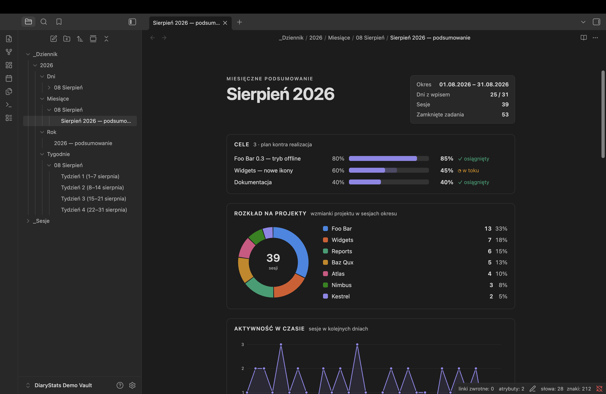
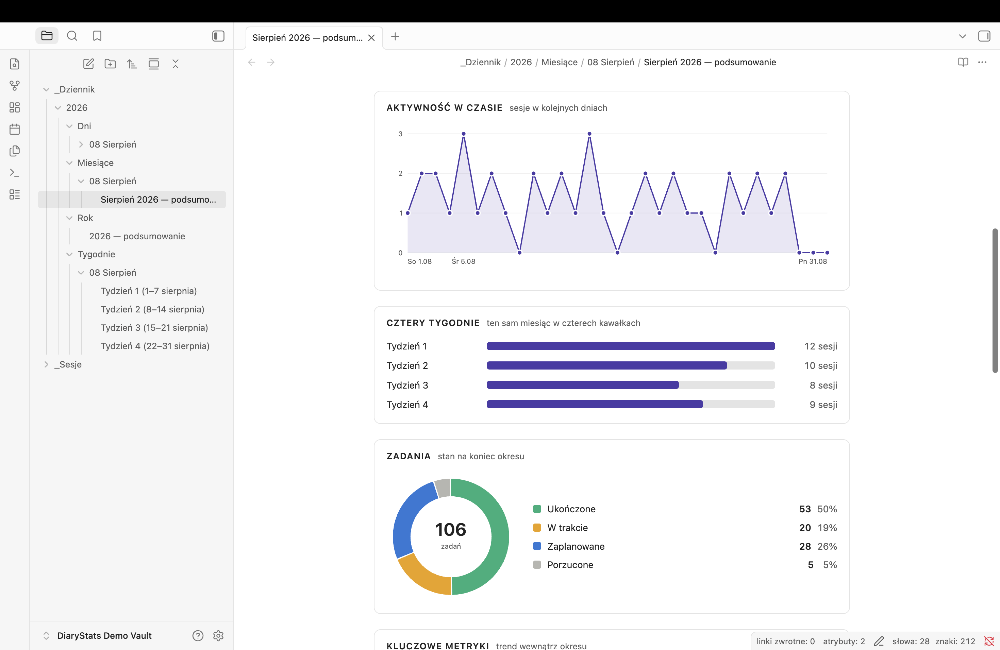

# Diary Stats

Charts for periodic notes in Obsidian. Drop one code block into a weekly, monthly
or yearly note and it draws what the period actually looked like — from the notes
you already write, with nothing extra to fill in.

```diary-stats
```

| Light | Dark |
|---|---|
|  |  |

Light and dark are two selected palettes, not one flipped — see [Colours](#colours).



## What it draws

| Panel | Reads |
|---|---|
| **Projects** | a donut of which projects the period went into, and — when more of them showed up than the donut has colours — bars unpacking what the folded *rest* slice is made of |
| **Activity over time** | sessions per day (per month in a yearly note) |
| **Four weeks** | the month split into its four weeks (monthly notes only) |
| **Tasks** | planned / in progress / done / dropped |
| **Key metrics** | totals with a sparkline and the change against the previous bucket |
| **Goals** | plan against actual — **only if you wrote any** |

Pick a subset with a `panele:` line:

```diary-stats
panele: projekty, zadania
```

## What a note has to say

The block works out the period from the note's own frontmatter, so nothing is
hardcoded and the same block works everywhere:

- weekly note — `od: 2026-08-01` and `do: 2026-08-07`
- monthly note — `miesiac: 2026-08`
- yearly note — `rok: 2026`

Day notes are found by filename: anything starting `YYYY-MM-DD` inside the diary
folder counts, so `2026-08-09 (niedziela).md` works as well as `2026-08-09.md`.

**Sessions** are links to notes named `YYYY-MM-DD-Something`. **Projects** come
from each session note's `dotyczy:` list, falling back to its `projekt/…` tags.

The donut runs out of distinguishable colours at eight, so everything past
**Projects shown separately** folds into one *rest* slice — which on a busy month
is the largest slice on the chart and says nothing. The bars under the donut list
that tail, largest first, with the rank it holds overall and its share of the
whole period. Only the tail: the slices above already have a name and a number in
the legend. Their colour is one ramp rather than eight repeated hues — the rows
are one group, and a bar tinted like a donut slice it has nothing to do with
would be a lie.

List a project under **Project names** in the settings and every spelling of it
(`FooBar`, `foobar`, `foo-bar`, `FOO BAR`) folds onto the one you wrote, so a
project never splits into two slices. Leave the setting empty — as it ships — and
every note is taken at its word.

**Tasks** use the four standard markers: `- [ ]`, `- [/]`, `- [x]`, `- [-]`.

## Goals are optional

Write a `## Cele` section and the goals panel appears. Leave it out and it does
not — no empty panel, no nagging.

Three ways to write a goal, mixable in one section:

```markdown
## Cele

- Project X v1.5 — offline mode :: 80 / 85
- [x] Ship the release
- [ ] Documentation
    - [x] readme
    - [x] settings
    - [ ] screenshots
```

**A percentage** — `:: plan / actual`. First number is the plan, second what you
reached. Only the plan is required.

**A checkbox** — done or not, no number to keep current.

**A checkbox with sub-tasks** — progress is their tally, and the panel shows
`2 / 3` instead of a plan figure. A dropped sub-task (`- [-]`) leaves the count
entirely: it is no longer part of the plan, so counting it as outstanding would
keep a finished goal looking unfinished. An in-progress one (`- [/]`) counts as
not done yet.

Anything without `::` and without a checkbox is prose and is ignored, so notes
can share the section.

## Weeks

Weeks run by day of month — 1–7, 8–14, 15–21, 22–end. Always four, always inside
one month. Calendar weeks straddle month boundaries and would make "four weeks of
August" impossible to draw.

## Settings

Folder names, the goals heading, project names, and how many projects get their
own colour before the rest folds into one slice.

## Language

**The interface is Polish.** Panel titles, month and weekday names, and the block's
`panele:` keywords are all Polish, and the defaults match a Polish vault
(`_Dziennik`, `_Sesje`, `Cele`). The folder names and the goals heading are
settings, so they move; the panel titles do not — not yet.

The frontmatter keys the plugin reads are Polish too: `od:`/`do:`, `miesiac:`,
`rok:`, and `dotyczy:` on a session note.

## Colours

Light and dark are two selected palettes, not one flipped. Both were checked for
colour-vision separation and contrast against the surface they render on. If you
reorder the slots in `styles.css`, re-run that check — adjacency is what the
validation was done against.

## Installation

**Settings → Community plugins → Browse**, search for *Diary Stats*, install and
enable it. Updates then arrive on their own.

<details>
<summary>Installing by hand, for a pre-release build</summary>

1. Take `main.js`, `manifest.json` and `styles.css` from a release (or build them —
   `npm install && npm run build`).
2. Put the three files in `<vault>/.obsidian/plugins/diary-stats/`.
3. Reload Obsidian and enable **Diary Stats** under Settings → Community plugins.

A copy installed this way does not update itself.
</details>

Needs Obsidian 1.12.7 or newer. Runs on desktop and mobile — nothing here touches
the file system directly.

## Licence

MIT.
